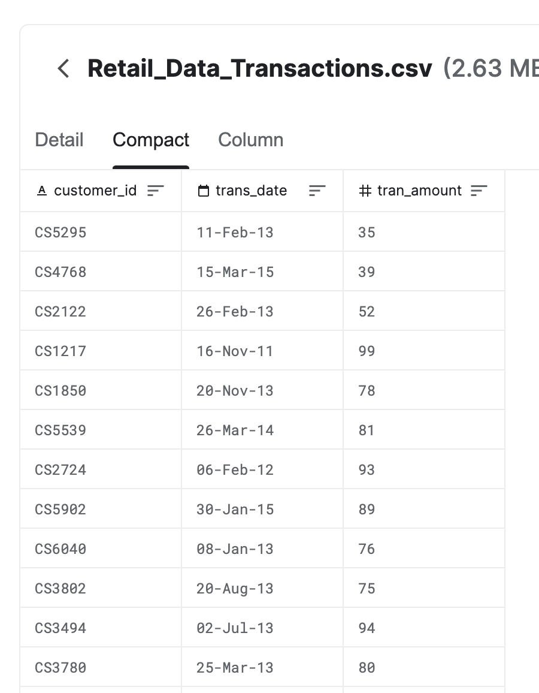

# Self Assessment Problems for CSCI E88C

The problem set below is to assess a student's readiness to take the Programming in Scala for Big Data Systems at https://courses.dce.harvard.edu/?details&srcdb=202501&crn=16769.

To complete the course successfully, you should be able to solve the problems below by writing code in any programming language of your choice. You do not have to turn in this self-assessment. The problem set is not graded.

### Dataset
The dataset for the problems is a retail transaction data set from Kaggle. A sample of the data is below:


The csv dataset is available at [Retail_Data Transactions](./Retail_Data_Transactions.csv)

### Problem 1
Write a program to read the csv file and return a list of data records, where each record corresponds to a row of values in the CSV file. You can use any data structure to represent a data record.

### Problem 2
Write a function that takes a list of input data records and returns a list of data records with high value transactions i.e., transactions with amount > 100.

E.g., the list of data records should contain
```
CS3904,20-Jul-14,103.0
CS2509,05-Dec-11,105.0
...
```

### Problem 3
Write a function that takes a list of input data records and returns a map or dictionary of average transaction amount by month and year.

E.g, The map of keys and values should contain
```
key -> value
(Dec,14) -> 78.0
(Nov,12) -> 71.0
(Mar,15) -> 39.0
(Mar,13) -> 64.0
...
```
### License
Copyright 2021-2024, Edward Sumitra

